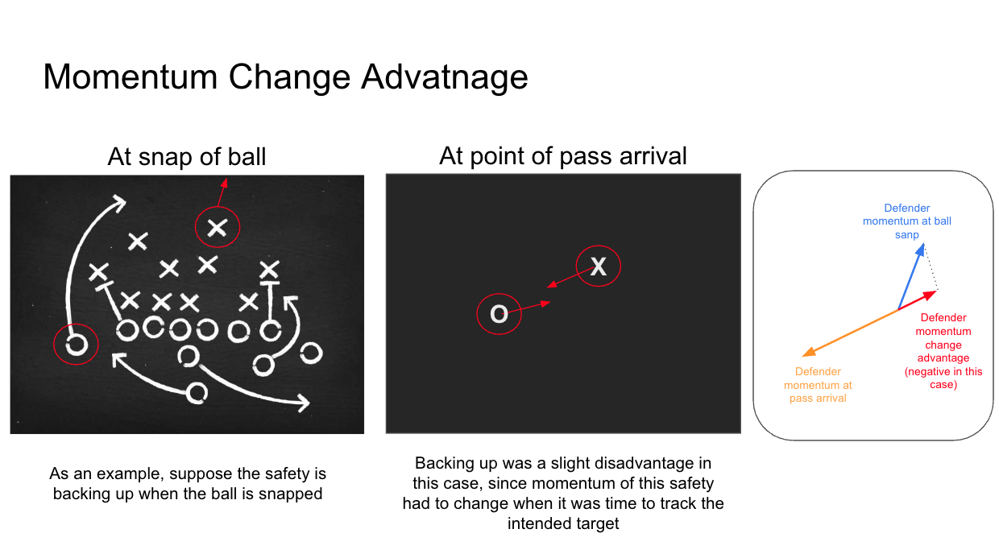

# NLF_Player_momentum_at_ball_snap
Using 2024 Big Data Bowl data, I calculate the momentum of the defender closest to the intended receiver to investigate if there are advantages to target areas based on pre-snap motion by defenders

